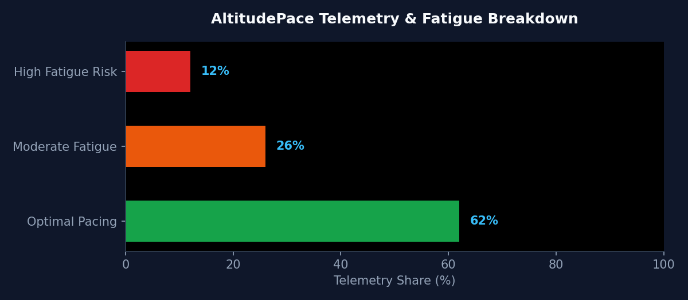

# 🏃‍♂️ AltitudePace: Biomechanical Marathon Telemetry Engine (`altitude-pace`)
[](https://github.com/jamesruga/altitude-pace/actions)


[](https://jamesruga.github.io/altitude-pace/)
An automated biomechanical signal processing and sports analytics engine inspired by Kenya's high-altitude endurance running legacy (Eldoret/Iten). AltitudePace ingests GPS, elevation, and physiological telemetry to compute Grade-Adjusted Pace (GAP), model heart-rate drift decay, predict muscle collapse risk, and render interactive Leaflet race strategy maps.
---
## 📖 Operational Context & Problem Solved
High-altitude training creates unique physiological pacing dynamics. When long-distance runners transition from high-altitude camps (~2,100m elevation) to sea-level marathons, unmonitored heart-rate drift and grade changes often lead to late-stage muscle collapse. AltitudePace provides low-latency telemetry feature engineering to optimize pacing splits and flag fatigue hotspots in real time.
---
## 📊 Telemetry & Fatigue Profile Visualization
Below is the dynamic biomechanical telemetry distribution profile across race segments computed automatically via the AltitudePace CI/CD pipeline:
<p align="center">
  
</p>

| Metric Category | Telemetry Share | Physiological Status | Risk Level |
| :--- | :--- | :--- | :--- |
| Optimal Pacing | 62% | Stable Heart-Rate Drift & Aerobic Efficiency | 🟢 Low |
| Moderate Fatigue | 26% | Aerobic-to-Anaerobic Drift Threshold | 🟠 Medium |
| High Fatigue Risk | 12% | Severe Grade-Adjusted Pace Loss / Muscle Collapse | 🔴 High |

---
## 🏗 Architecture & Stack
- Telemetry Processing: Python 3.10+, Pandas, NumPy, gpxpy
- Biomechanical Logic: Grade-Adjusted Pace (GAP), Heart-Rate Drift Decay, Multi-Tier Fatigue Risk Classifier
- Geospatial Mapping: Folium / Leaflet.js
- Quality Assurance: pytest unit test suite
- CI/CD Automation: GitHub Actions scheduled cloud execution with GitHub Pages map deployment
---
## 🌐 Live Interactive Map
Access the live interactive Folium map on GitHub Pages:
👉 https://jamesruga.github.io/altitude-pace/
---
## 🛠 Local Quickstart & Testing
```bash
# Clone repository & install dependencies
git clone [https://github.com/jamesruga/altitude-pace.git](https://github.com/jamesruga/altitude-pace.git)
cd altitude-pace
pip install -r requirements.txt
# Run pytest unit tests
PYTHONPATH=. pytest -v
# Generate telemetry and render map
python src/dataset.py
PYTHONPATH=. python src/visualize.py
```
---
## 📜 License
Distributed under the MIT License. See LICENSE for details.
